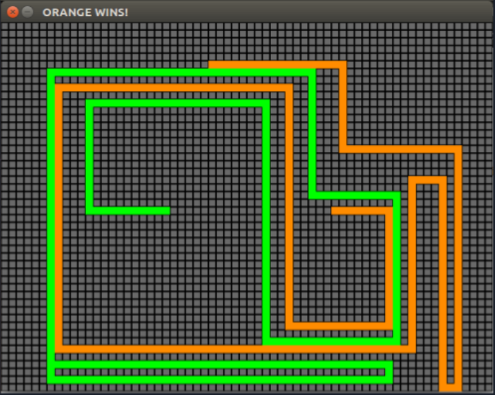
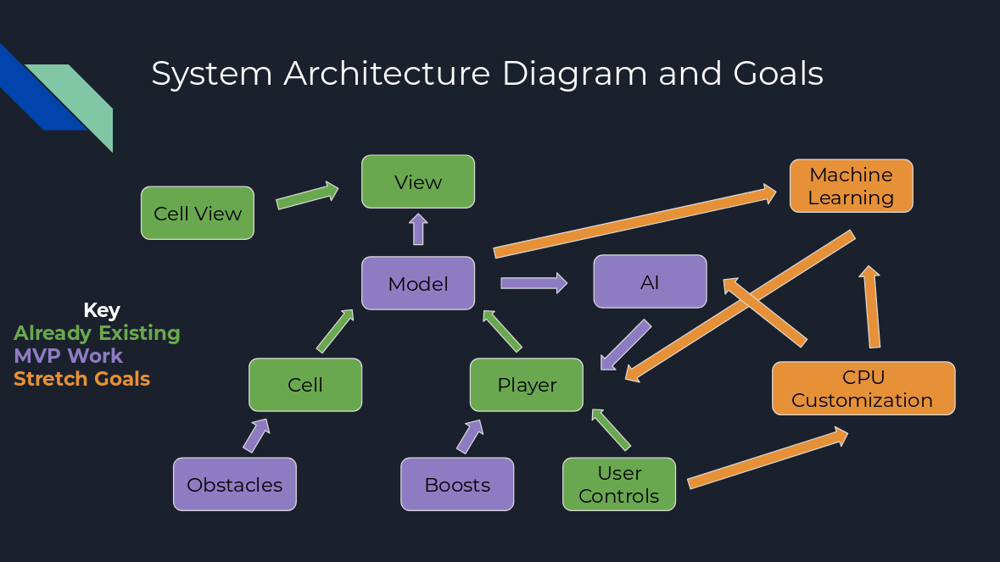
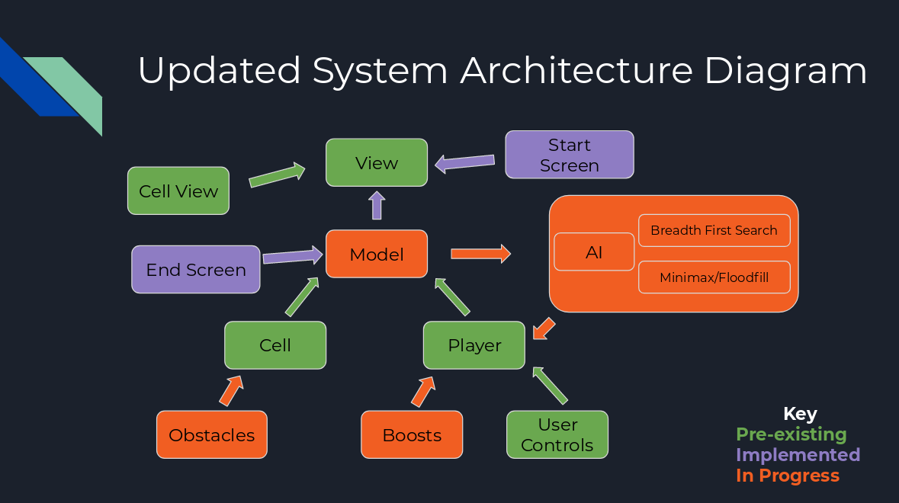
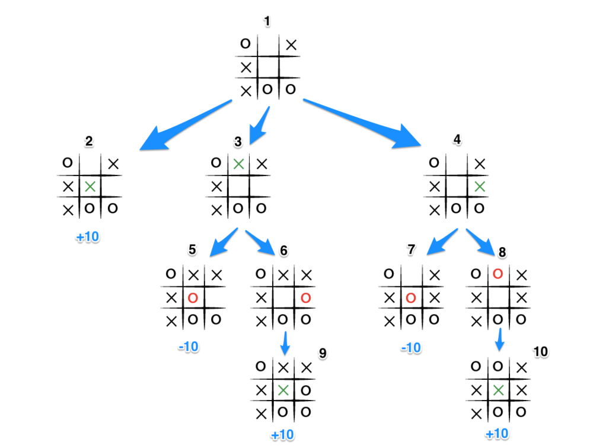
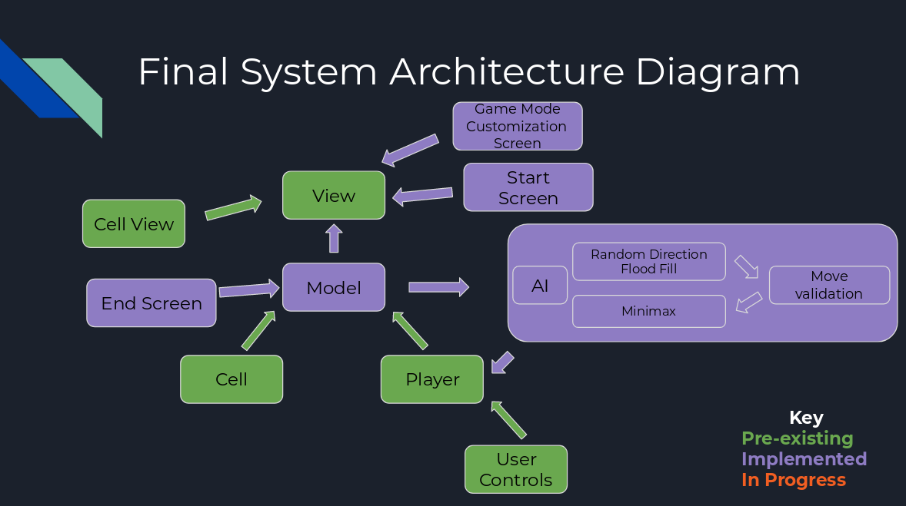
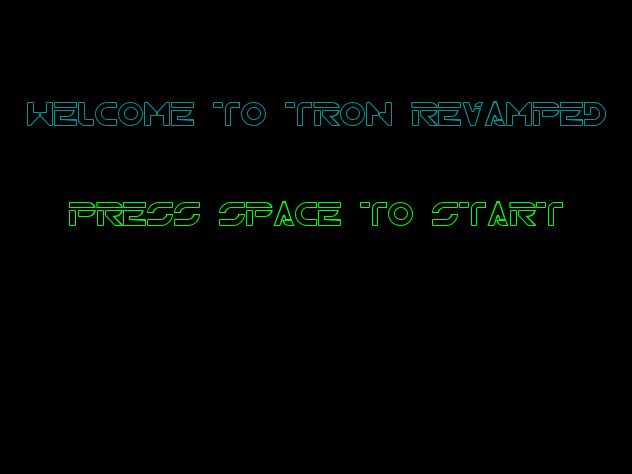
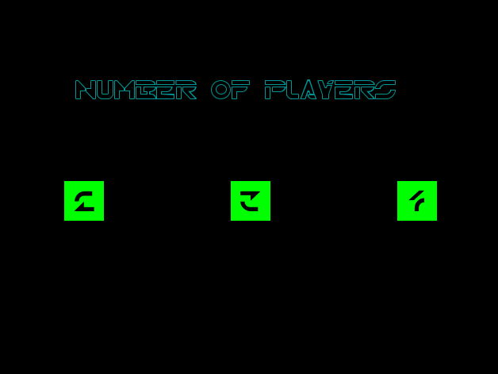
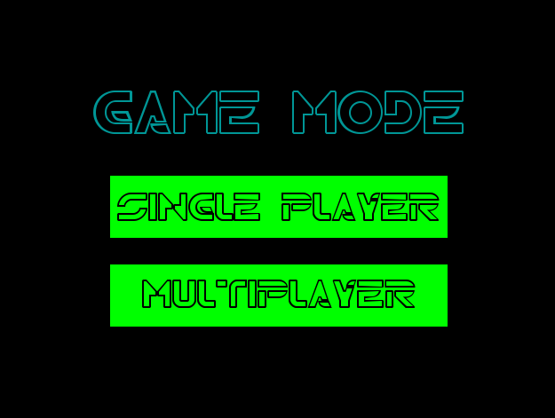
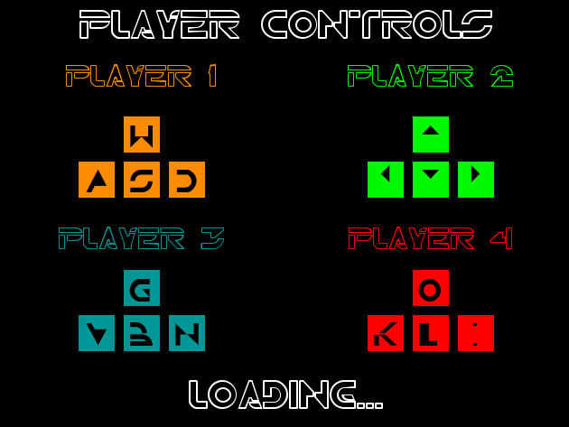

# Detailed Project Description
#### [Return to the project overview](index.md)
## Project Evolution & Narrative

Our initial project goal was to learn about simple game-playing AI through designing and implementing a 'CPU' type player in a preexisting build of Tron Light Bikes created by one of our team's members in a previous project:

Initially, we intended to create a game with both AI and machine learning as well as varied playing fields that could include game modes, obstacles of various, and different levels. Our proposed game modes included the preexisting Player vs. Player mode as well as adding a Player vs. a combination of Players and CPUs, which could be selected from a splash screen. In addition, taking inspiration from another team member's previous project, a dynamic background mode in which multiple CPUs play each other to create random geometric art was proposed.

Initial System Architecture Diagram

We all shared the common goals of gaining familiarity and comfort with working on a software project collaboratively, which was accomplished through compartmentalizing each class, allowing multiple team members to work on the project simultaneously without interfering with each other. Additionally, since none of us had any experience with game-playing AI, we all began the project with the goal of building a conceptual understanding of how it works, as well as gaining experience with building a rudimentary AI.

Based on the feedback form and in-class discussion from the first architectural review, we elected to emphasize the multiplayer with CPUs aspect of our game. Our reviewers seemed to see little merit in the dynamic background mode, with most of our feedback surrounding user experience and the game’s features. In terms of graphics and visuals, our reviewers suggested adding more ‘tron-like’, less ‘pygame-like’ overall graphics feel, with sound effects, obstacles, and themes. More complex features such as adding physics (deceleration/acceleration/turning radius to the ‘bikes’) or multiple CPUs running on different AI architects were also suggested. Nearly all of our reviewers were strong proponents of the mixed Player vs. Player vs. CPU(s) mode. Unfortunately, all the insight we were able to gain, though valuable, was fairly superficial, and we were unable to gain significant insight into where to start with AI design and implementation, which remained a 'black hole' of knowledge and comprehension for the team. We were, however, encouraged to implement several types AI, to rank them based on difficulty and win rate.

As we began to delve into creating an AI (machine learning had been abandoned due to its complexity), we explored several strategies including A*, Breadth First Search, Dijkstra's Algorithm, and, after meeting with a knowledgeable upperclassman, Flood-Fill MiniMax, which we elected to implement:

Our feedback from the second architectural review supported a narrowing of our previous goals to implement only an AI, as progress was slow and our deadline approached quickly. Since our reviewers had little experience with developing AI algorithms, we instead discussed the potential behaviors of our AI. The general consensus was that a defensive bot would probably be easier to begin with, as an aggressive bot would also need to predict the players’ next moves. However, many did think that once the minimax was refined it would be interesting to also attempt a more aggressive bot.

Our project employs the well-known MiniMax algorithm described in greater detail below.

## Implementation
Our project employs one of the most basic AI algorithms, MiniMax. At its core, MiniMax attempts to determine the best decisions or moves for a player based analyzing several possible moves and its opponent's response, to a pre defined depth (number of moves), with the assumption that an opponent will always attempt to put itself in the best possible position for each move (eg. not sacrificing the appearance of success in the near-game as a long-term strategy). In its most basic implementation, moves with a successful outcome are given a positive score while harmful or losing moves are given a negative score. For each level of depth search, unsuccessful 'branches'(possible moves or sets of moves) or branches that prove to be worse than a previously examined move will be 'pruned' from the main search tree in a process known as Alpha-Beta Pruning. MiniMax then returns the set of moves with the greatest score.

The below image depicts how a MiniMax AI will tree search all the possible moves and responses in a tic tac toe game. The branch with the greatest final score is returned.

MiniMax performance can be improved with custom heuristics, such as weighting near-game moves more heavily, since the long-game is uncertain.

Our final MiniMax algorithm relies on a flood fill search strategy to determine the longest possible path of travel without colliding with an opponent. Our flood fill implementation, much like the one below, searches the entirety of the playing field to determine the set of possible points to which the AI can travel.

MiniMax is then applied to the flood fill data to determine the best (in our case, longest) path.

The AI component of our final system design relies on a flood fill algorithm which randomly and progressively searches throughout the playing field. Valid moves are then returned to the MiniMax function which maximizes the possible distance traveled.

In addition to the AI, we have added multi-player and multi-AI modes with their respective configuration screens, as well as improved stability and function to the overall program.

## Detailed Game Description (results)

* Screen caps of game play and various features
* Show AI effectiveness through end-game screen caps
* Gif of gameplay
