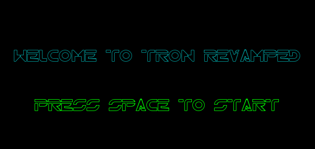

#### For a more detailed description of our project and process, click [here](details.md)

# Creating a Tron AI
`Revamping-Tron-AI` is a remake of the classic arcade game Tron with a few twists. Based on the Tron minigame, Tron Light Cycles, the classic multiplayer snake game has been recreated.

* add gif of gameplay

# Getting Started
## Installing Pygame
In order to run `Revamping-Tron-AI` and play our Tron game, you need to have `pygame` installed. To install `pygame` for python3, enter in the command window
``` bash
$ pip install pygame
```

## Obtaining the code
To obtain the code to run `Revamping-Tron-AI`, the repository should be cloned.
``` bash
$ git clone https://github.com/chiunaomi/Revamping-Tron-AI.git
```
## Running the code
To play our game after the repository has been cloned, run the `main.py` file.
``` bash
~/Revamping-Tron-AI$ python3 main.py
```

# Attribution
Original game framework created by [Naomi Chiu](https://github.com/chiunaomi) and [Hadleigh Nunes](https://github.com/hadleigh-000) can be found [here](https://github.com/chiunaomi/InteractiveProgramming).
Additional work to create AI done by [Naomi Chiu](https://github.com/chiunaomi), [Alex Frye](https://github.com/AlexFrye) and [Jessie Potter](https://github.com/JessiePotter).
